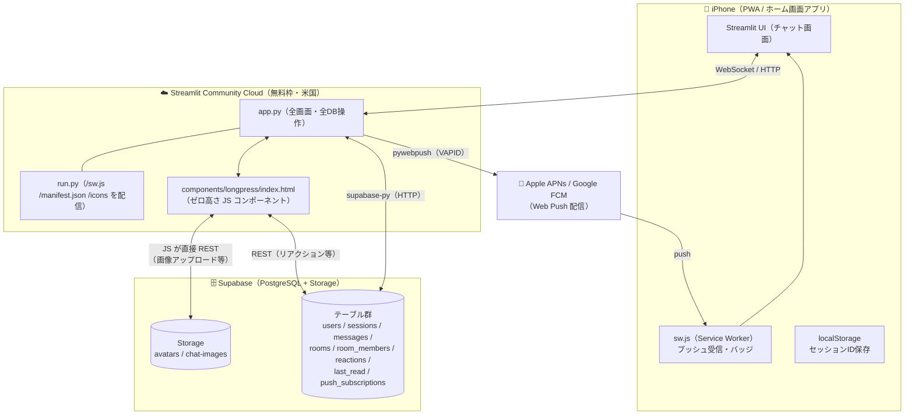
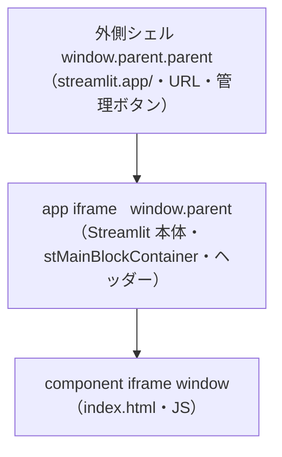
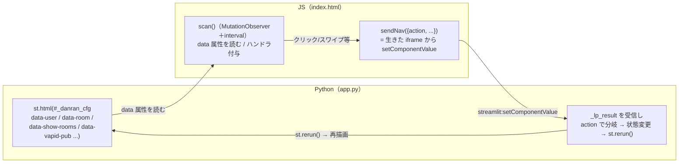
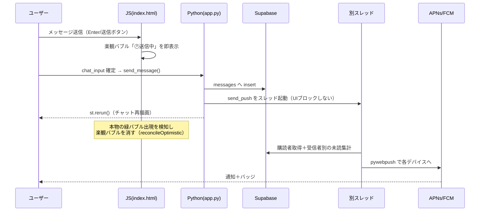
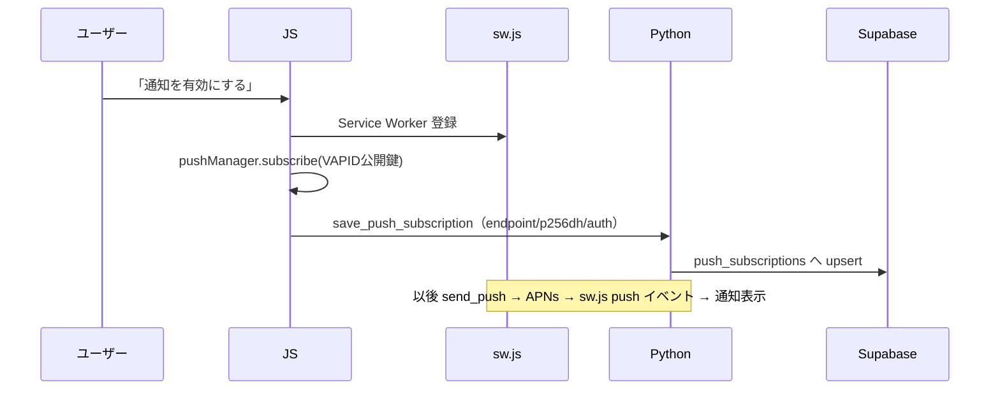

# danran アーキテクチャ図解

> 自分（開発者）の理解用。全体像をつかむためのマップ。
> 実装の細かい注意点・ハマりどころは [`CLAUDE.md`](./CLAUDE.md) を参照。

---

## 1. これは何か

- **danran（団欒）** = 家族専用チャット PWA
- **スタック**: Python + Streamlit（UI/サーバー）＋ Supabase（PostgreSQL + Storage）
- **特徴**: Streamlit という「本来チャット向きでない」フレームワークの上に、ゼロ高さの
  カスタム JS コンポーネントを組み合わせて LINE 風 UX を実現している。

---

## 2. システム全体構成



ポイント:
- **2つの経路で Supabase を触る**: Python（`supabase-py`）と、JS コンポーネント（`fetch` で REST）。
  画像アップロードやリアクションは JS から直接。送信メッセージの挿入＋プッシュは Python。
- **プッシュは Python だけ**が送れる（`pywebpush` + VAPID 秘密鍵はサーバー専用）。

---

## 3. 最重要：3層 iframe 構造

Streamlit Cloud は入れ子の iframe で動く。これを理解しないとセッション・ナビ・スワイプの
コードが意味不明になる。



- `st.query_params` が読むのは**外側シェル**の URL。
- カスタムヘッダー・メッセージ DOM は **app iframe** にある。
- JS（index.html）は最下層。`window.parent.document` で app iframe の DOM を操作する。

### 「死んだ iframe」問題（最重要の落とし穴）

component iframe は再生成されることがある。**DOM 要素へ1回だけ張ったハンドラ**を古い
（死んだ）iframe が持っていると、その window からの `postMessage` を Streamlit が
`event.source` 不一致で**無視**する → 「スワイプ不発」「ルームに入れない」「ボタンが効かない」。

→ **対策**: `scan()` が毎回ライブ iframe の送信口を `pDoc._danranSend` に登録し、
ナビ送信は必ず **`sendNav(val)`** 経由にする。タイマー系（トースト/カバー）は
`data-*-expire` を持たせて scan が掃除する。

---

## 4. JS ⇄ Python の通信

Python は HTML の data 属性で「状態」を渡し、JS は `setComponentValue` で「指示」を返す。



- 全 `action` に `ts: Date.now()` を付け、Python は `_last_nav_ts` で**1回だけ**処理（二重発火防止）。
- 主な action: `go_rooms / go_chat / go_room / go_room_edit / go_room_create / go_profile /
  go_back / go_notifications / restore_session / save_push_subscription`。

---

## 5. 画面遷移

```
                ┌─────────────────────────────┐
   未ログイン →  │ select_user（ログイン）        │
                └──────────────┬──────────────┘
                        do_login / セッション復元
                               ↓
        ┌──────────────────────────────────────────┐
        │ view="chat"                                │
        │   ├ _show_rooms=False → チャット（メッセージ）   │
        │   └ _show_rooms=True  → ルーム選択（トップ）      │
        └───┬───────────────┬───────────────┬────────┘
            │ 👥/⚙️          │ ＋             │ 右上アバター
            ↓               ↓               ↓
        room_edit       room_create       profile
       （メンバー管理）   （新規ルーム）     （編集＋通知設定＋ログアウト）
                                               ↓
                                          notifications
```

- ルーム選択 ⇄ チャットは **view を変えず** `st.session_state["_show_rooms"]` で切替
  （URL を変えると iOS の戻るジェスチャーと競合するため）。

---

## 6. データモデル

```mermaid
erDiagram
    users ||--o{ sessions : has
    users ||--o{ messages : sends
    users ||--o{ room_members : joins
    users ||--o{ last_read : tracks
    users ||--o{ push_subscriptions : owns
    rooms ||--o{ room_members : "has members"
    rooms ||--o{ messages : "contains (room_name)"
    messages ||--o{ reactions : has

    users { uuid id PK; text name; text avatar; text phone; text password_hash }
    sessions { uuid id PK; uuid user_id FK; timestamptz created_at }
    rooms { uuid id PK; text name; text icon }
    room_members { uuid id PK; uuid room_id; uuid user_id }
    messages { uuid id PK; text room_name; uuid user_id; text content; text image_url }
    reactions { uuid id PK; uuid message_id FK; text user_name; text emoji }
    last_read { uuid user_id; text room_name; timestamptz read_at }
    push_subscriptions { uuid id PK; uuid user_id FK; text endpoint; text p256dh; text auth }
```

注意:
- `messages` ⇄ `rooms` は `room_name`（文字列）で紐づく（FK ではない）。ルーム名は**グローバル一意**。
- `room_members` で「招待制ルーム」を実現（`fetch_rooms(user_id)` が参加ルームのみ返す）。
- RLS は全許可（家族アプリ）。アクセス制御は**アプリ層**＝完全秘匿ではない。

---

## 7. リアルタイム（ポーリング方式）

WebSocket プッシュではなく **Streamlit フラグメントの定期 rerun** でポーリング。

| フラグメント | 周期 | 役割 |
|---|---|---|
| `render_messages()` | 2秒 | メッセージ取得・描画・既読マーク・新着トースト |
| `render_room_list()` | 5秒 | ルーム選択中の未読バッジ更新 |

- 両者とも冒頭ガード必須（`_show_rooms`/`current_user`/`view`）。無いと遷移直後にちらつく。
- **既知の課題**: 2秒再描画で画像が再ペイントされ得る（チカチカ）。根治には「変化時のみ描画」へ refactor が必要。

---

## 8. 代表的なフロー

### メッセージ送信（楽観的 UI ＋ プッシュ）



- スレッド内は `st.*`（secrets/cache）を呼ばない（ScriptRunContext 不在で失敗するため）。
  VAPID 鍵はメインで取得して渡す。未読は `_member_room_names()` で受信者ごとに集計。

### ルーム入室の遷移（チカチカ隠し＋🏠ローディング）

```
タップ → showEnterCover()（即・地色カバー＋160ms後に🏠danran）
       → go_room（sendNav）→ Python 状態確定 → st.rerun()
       → チャット描画 → scrollToLatestOnEnter() が最下部へ寄せて
       → 高さ安定でカバーをフェードアウト
```

### PWA / プッシュ通知



- iOS は **ホーム画面追加した PWA** からのみ Web Push 可（Safari タブは不可）。
- VAPID 秘密鍵は RAW base64url 43文字形式（[`CLAUDE.md`](./CLAUDE.md) 参照）。

---

## 9. デプロイ

```
git push origin main
      ↓（1〜2分）
Streamlit Community Cloud が自動デプロイ
```

- 起動: `uv run python run.py`（`/sw.js` 配信のため必須）。
- JS（index.html）変更時は `app.py` の component 名 `danran_lp_vNN` をインクリメント
  （ブラウザキャッシュ破棄）。
- Supabase は MCP ツールで操作。セッション TTL・keep-alive は pg_cron。

---

## 10. もっと詳しく

- 実装の注意点・過去の失敗・ハマりどころ → [`CLAUDE.md`](./CLAUDE.md)
- メモリ（横断的な学び）→ `~/.claude/projects/.../memory/`（VAPID 形式・生きた iframe・WS プロキシ）
